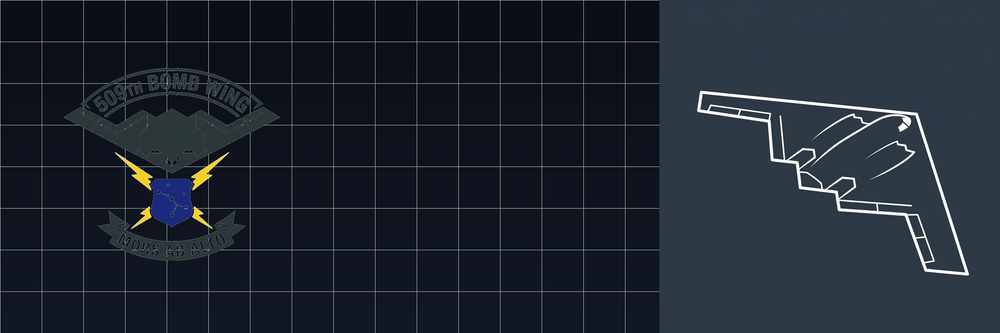
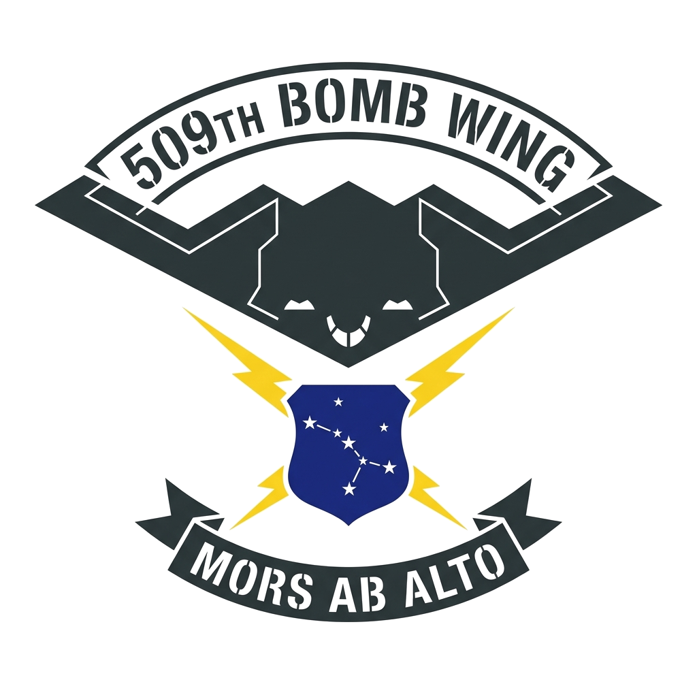
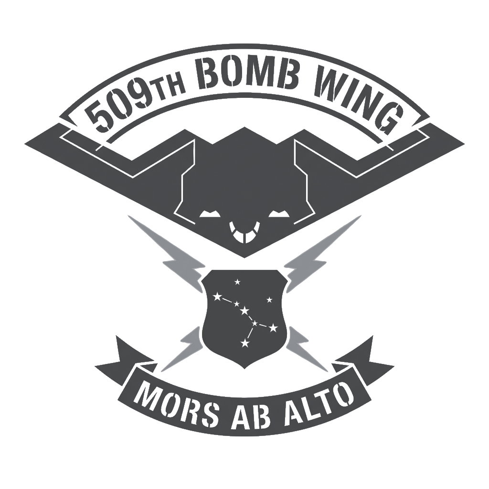

# B-2 Spirit Stealth Bomber — DCS World Standalone Module

<p align="center">
  
</p>

<p align="center">
  <a href="https://github.com/Apkallu-Industries/B-2-Spirit/releases"></a>
  
  
  
  
</p>

> **Development status:** the exterior airframe and full 3D cockpit interior are
> **operational and flyable in DCS World**. Features a high-poly authentic flight deck
> (`B-2_Spirit_Cockpit.EDM`), authentic ACES II ejection seats, HOTAS flight controls,
> 4-lever throttle quadrant, calibrated HUD combiners, and 4K PBR textures. See
> **[`COMPLETION_STATUS.md`](COMPLETION_STATUS.md)** for full documentation.

---

## 🦅 Overview

The **Northrop Grumman B-2 Spirit** is a premier low-observable, strategic, long-range heavy stealth bomber. This high-fidelity community module brings the iconic "flying wing" to **DCS World**, featuring a calibrated **52.4-meter wingspan**, authentic flight physics, internal rotary weapons bays, custom cockpit views, fully rigged animation channels, and high-resolution 4K PBR stealth materials.

Developed and maintained by **Apkallu Industries** under the *Autonomous Drone Pack* initiative.

---

## ✨ Key Features

- ✈️ **Authentic Airframe Scaling**: Precision 1:1 scale (52.42 m wingspan, 21.0 m length, 5.18 m height) calibrated from engineering data.
- 🎨 **4K PBR Stealth Pipeline**: Custom Diffuse, Normal, and RoughMet maps simulating radar-absorbent material (RAM) coatings and canopy tinting.
- 🕹️ **13 Animated Argument Channels**: Fully rigged flight surfaces, landing gear retraction, and rotary weapons bay doors compiled to native DCS `.EDM`.
- 💣 **Dual Internal Rotary Bays**: Station 1 (Left) and Station 2 (Right), each loaded with a validated precision-guided munition set — GBU-31 / GBU-31(V)3B penetrator / GBU-32 / GBU-38 JDAM, GBU-10 & GBU-12 Paveway II LGBs, AGM-154C JSOW, and CBU-87 / CBU-97 clusters. 8 Mission Editor loadout presets included.
- 💺 **Three-Crew Cockpit**: Pilot in Command (left), Mission Commander / Weapons Officer (right), and a Relief Crew jump seat with an aft crew-rest area for long-duration sorties — all seats `can_be_playable`.
- 🛡️ **Logical Damage Model**: Flying-wing damage cells (four buried engines, elevons + split decelerons, three-wheel gear) with inboard failure propagation.
- 🎯 **Instant Action & Missions**: FL350 high-altitude ingress and Senaki-Kolkhi Runway 09 hot start missions with verified weather parameters.
- 🎖️ **Virtual Squadron Roster**: Authentic Whiteman AFB liveries with painted military aircraft decals and low-observable stealth stencils.

---

## 📐 Flight Model & Animation Arguments

All control surfaces and mechanical components are animated according to official DCS argument channel conventions:

| Arg ID | System Component | Deflection / State | Movement Type |
| :--- | :--- | :--- | :--- |
| **0** | **Nose Landing Gear** | `0.0` (Down/Locked) $\leftrightarrow$ `1.0` (Retracted) | Strut retraction & forward bay doors |
| **3** | **Left Main Landing Gear** | `0.0` (Down/Locked) $\leftrightarrow$ `1.0` (Retracted) | Main gear rotation & outer bay door |
| **5** | **Right Main Landing Gear** | `0.0` (Down/Locked) $\leftrightarrow$ `1.0` (Retracted) | Main gear rotation & outer bay door |
| **11** | **Left Outboard Elevon** | `-1.0` (Down $-25^\circ$) $\leftrightarrow$ `+1.0` (Up $+25^\circ$) | Pitch & Roll |
| **12** | **Right Outboard Elevon** | `-1.0` (Down $-25^\circ$) $\leftrightarrow$ `+1.0` (Up $+25^\circ$) | Pitch & Roll |
| **13** | **Left Split-Rudder Deceleron** | `0.0` (Closed) $\leftrightarrow$ `+1.0` (Split $+35^\circ$) | Yaw control & drag airbrake |
| **14** | **Right Split-Rudder Deceleron**| `0.0` (Closed) $\leftrightarrow$ `+1.0` (Split $+35^\circ$) | Yaw control & drag airbrake |
| **16** | **Inboard Elevons** | `-1.0` (Down $-25^\circ$) $\leftrightarrow$ `+1.0` (Up $+25^\circ$) | Pitch trim & roll augmentation |
| **17** | **Beaver-Tail Trim Flap** | `-1.0` (Down $-15^\circ$) $\leftrightarrow$ `+1.0` (Up $+15^\circ$) | Center pitch trim & gust alleviation |
| **86** | **Left Weapons Bay Doors** | `0.0` (Closed) $\leftrightarrow$ `+1.0` (Open $90^\circ$) | Dual clamshell rotary bay doors |
| **87** | **Right Weapons Bay Doors** | `0.0` (Closed) $\leftrightarrow$ `+1.0` (Open $90^\circ$) | Dual clamshell rotary bay doors |

---

## 🎨 Squadron Liveries & Markings

<p align="center">
  
  &nbsp;&nbsp;&nbsp;&nbsp;
  
  &nbsp;&nbsp;&nbsp;&nbsp;
  
</p>

The module includes four operational squadron paint schemes selectable from the DCS Mission Editor and in-game rearming menu:

1. **`USAF 509th Bomb Wing (Whiteman AFB)`**: Wing Flagship Command with full-color heritage crest on nose gear door and crew hatch.
2. **`13th Bomb Squadron 'Grim Reapers'`**: Combat strike line jet with subdued low-observable tactical markings.
3. **`393d Bomb Squadron 'Tigers'`**: Global strike mission jet with authentic squadron tail markings.
4. **`325th Weapons Squadron`**: USAF Weapons School operational tactics evaluation scheme.

---

## 🚀 Installation

### Option 1: Automatic Sync via PowerShell
```powershell
# Run from repository root:
robocopy ".\B-2 Spirit" "$HOME\Saved Games\DCS\Mods\aircraft\B-2 Spirit" /MIR /FFT /Z /W:5 /R:2 /XD .git
```
*(For DCS OpenBeta, target `$HOME\Saved Games\DCS.openbeta\Mods\aircraft\B-2 Spirit`)*

### Option 2: Manual Drag & Drop
1. Copy the **`B-2 Spirit`** folder.
2. Paste it into your DCS Saved Games aircraft mods directory:
   ```text
   C:\Users\<YourUsername>\Saved Games\DCS\Mods\aircraft\B-2 Spirit\
   ```
3. Restart DCS World.

---

## 🎮 Included Missions

- **`B-2_Spirit_Free_Flight.miz`**: Dual client slots featuring a high-altitude ingress over the Black Sea at FL350 (450 kts) and a runway-hot takeoff slot on Senaki-Kolkhi Runway 09.
- **`B-2_Spirit_High_Altitude.miz`**: Direct combat ingress at 35,000 ft with navigation waypoints.
- **`B-2_Spirit_Runway_Hot.miz`**: Scramble takeoff ready at the active runway hold line.

---

## 📂 Repository Structure

```text
B-2-Spirit/
├── B-2 Spirit/                       <-- Core DCS World Mod Root
│   ├── Cockpit/Scripts/              <-- Cockpit device/panel scripts (stubs; see roadmap)
│   ├── Encyclopedia/                 <-- In-game encyclopedia entry & high-res profile
│   ├── Input/B-2 Spirit/             <-- Keyboard, mouse, joystick, & Xbox controller diffs
│   ├── Liveries/B-2_Spirit/          <-- 509th BW, 13th BS, 393d BS, 325th WPS liveries
│   ├── Missions/                     <-- QuickStart & Single Player .miz files
│   ├── Shapes/
│   │   ├── B-2_Spirit.EDM            <-- Compiled DCS 3D exterior (animated channels)
│   │   └── Cockpit_Source/           <-- Blender cockpit interior source + build scripts
│   ├── Textures/                     <-- 4K PBR texture sets (Diffuse, Normal, RoughMet)
│   ├── Theme/                        <-- UI backgrounds, transparent award badges, & icons
│   ├── UnitPayloads/                 <-- Mission Editor loadout presets
│   ├── B-2.lua                       <-- Aircraft aero, engine, sensors, crew, weapons, damage
│   ├── entry.lua                     <-- Module registration & DCS plugin hooks
│   └── Views.lua                     <-- Pilot & Mission Commander 6DOF camera horizons
├── assets/                           <-- High-res stencils, painted decals, & banners
├── source/                           <-- Raw 3D source (pbr_b-2_spirit.glb)
├── COMPLETION_STATUS.md              <-- Done / blocked / remaining roadmap
├── DCS_MOD_DEVELOPER_TROUBLESHOOTING_GUIDE.md  <-- Engineering fault/resolution log
└── README.md                         <-- Project Documentation
```

---

## 🛠️ Development Status & Roadmap

The full, current roadmap lives in **[`COMPLETION_STATUS.md`](COMPLETION_STATUS.md)**.

**Done:**
- Plugin load & Mission Editor registration · aircraft descriptor (mass, SFM aero/engine, sensors, radio) · three-crew model.
- Validated weapons & payloads (GBU-31/32/38 JDAM, LGB, JSOW, CBU) · logical damage model.
- Animated exterior EDM (`B-2_Spirit.EDM`) with 13 control surface and landing gear arguments.
- 4K PBR exterior textures, Whiteman AFB liveries, quick-start & combat missions, custom input profiles.
- **Authentic 3D Cockpit EDM (`B-2_Spirit_Cockpit.EDM`)**: High-poly ACES II ejection seats (63k vertices), HOTAS flight sticks, rudder pedals, 4-lever throttle quadrant, switch banks, UFC CDU keypads, and HUD combiners.
- **34 4K DDS Cockpit Textures**: VFS mounted via `entry.lua` (`/Textures/Cockpit_Donor`).
- **Cockpit Ergonomics & Clearance**: Clean forward pilot & copilot views through HUD/windscreen, A-pillars moved outboard to side walls, overhead controls flush-mounted to ceiling spine at Z=2.75 with full standing headroom.

**Next Steps / Roadmap:**
- Clickable avionics and MFD page interactions (`mainpanel_init.lua` device hooks).
- Internal lighting and night illumination data.
- Custom F118 engine audio package.
- Advanced EFM flight model tuning and multicrew integration.

---

## ⚖️ License & Attribution
Developed for the DCS World flight simulation community by **Apkallu Industries**.  
*For non-commercial flight simulation use only.*
